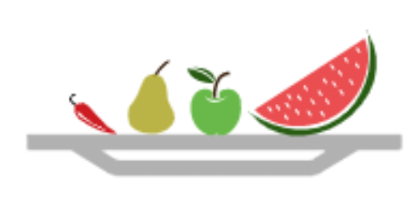

# Dietlogue 
A food nutrition tracker built with React + Django

Timeframe: 6 days. 

## Project Brief

- **Build a full-stack application** by making your own backend and your own front-end
- **Use a Python Django API** using Django REST Framework to serve your data from a Postgres database
- **Consume your API with a separate front-end** built with React
- **Be a complete product** which most likely means multiple relationships and CRUD functionality for at least a couple of models
- **Implement thoughtful user stories/wireframes** that are significant enough to help you know which features are core MVP and which you can cut
- **Have a visually impressive design** to kick your portfolio up a notch and have something to wow future clients & employers. **ALLOW** time for this.
- **Be deployed online** so it's publicly accessible.
- **You May** use the React Hooks syntax on your front end, but the responsibility of this will be largely on yourself.

## User Story
- User can create an account and log food they eat 
- User can see a chart displaying the weekly trend of nutrition intakes on their account page
- User can see a progress bar displaying the daily intake of nutritions compared to the recommended daily value of nutrition on their account page
- User can see a detailed log of daily food intakes and their nutrition values on their account page
- User can edit logs and back-date missing logs

## Technologies Used
- Frontend: JavaScript (ES6), HTML5, SCSS, Bulma CSS Framework, React.js, Moment.Js, Plotly.js
- Backend: Python, JWT, Django, Django REST Framework
- Other: Git, GitHub, Yarn, Pip, Heroku

## Design Process

- We started with building our database relationship using Quick DBD software (https://www.quickdatabasediagrams.com/):
        

- Then we planned what we want each page to look like using wireframe:
<span>
        <span> </span>
        <span></span> 
        
</span>
<span>
        
        
</span>

- We decided to work on the backend doing pair programming 
- We put together a list of frontend tasks to work separately on different parts
```
TODO:
X register form
X login form
- use cloudinary for user image upload
X user selects name and selection gives us id.
X when component mounts (create or edit log) run api request to get table of all foods
X add view to food model in order to get names and id for front end selector
X add history button to navbar and history page with just all logs listed in descending order
X portion unit conditional on the type of food - replaced with portion helper data, showing how much in grams
X my account
  X layout
  X chart

X secure route
X replace requests with token from Auth
X navbar burger
X logout functionality
X table rows - links to log edit
X add datetime field to log entry
X log edit form
X log history multiply by portion
X register component extra details
X change models to restrict empty entries
X handle errors after models restriction
X add standard diet values  
X add diet depending on age
- add baseline for healthy daily intake
- footer
X styling:
  X logo
  X fonts
  X slogan 
  X style register
- refactor and de-structure
X remove console.logs
- replace moment js with something lighter or built myself
- refactor new and edit component to separate form
X style table rows to show as link
```

### Backend 
**Food Model**: We decided to create an ancillary food database that we would populate later with food details. This way we could expand functionality for users to be able to add their own food items.

```Python
class Food(models.Model):
    name = models.CharField(max_length=200)
    measure = models.DecimalField(max_digits=8, decimal_places=2)
    unit = models.CharField(max_length=200)
    grams = models.DecimalField(max_digits=8, decimal_places=2)
    calories = models.DecimalField(max_digits=8, decimal_places=2)
    protein = models.DecimalField(max_digits=8, decimal_places=2)
    carbs = models.DecimalField(max_digits=8, decimal_places=2)
    fiber = models.DecimalField(max_digits=8, decimal_places=2)
    fat = models.DecimalField(max_digits=8, decimal_places=2)
    sat_fat = models.DecimalField(max_digits=8, decimal_places=2)

    def __str__(self):
        return self.name
```
**Log Model**: The log models is relatively simple having just food id, portion, owner and date. Originally instead of date we have put automatic created_at field, but then we thought that user should have an option to choose the date in order to back-date missing logs.

```Python
class Log(models.Model):
    food = models.ForeignKey(Food, related_name='food', on_delete=models.CASCADE)
    portion = models.PositiveSmallIntegerField()
    owner = models.ForeignKey(User, related_name='logs', on_delete=models.CASCADE)
    date = models.DateField()
```

**User Model**: We expanded the built-in Django user model to include our custom fields
```Python
class User(AbstractUser):
    GENDER_CHOICES = (
        ('M', 'Male'),
        ('F', 'Female'),
    )
    height = models.PositiveSmallIntegerField()
    weight = models.FloatField()
    gender = models.CharField(max_length=1, choices=GENDER_CHOICES)
    dob = models.DateField(max_length=8)
    profile_image = models.CharField(max_length=500, blank=True)
```
### Frontend
**Register & Login**: we use the built-in authentication of Django 


**Create new log**: we used React Select component for food selection pulling the data from our food database. We also have a helper function to show a hint data for selected product.

```JavaScript
dataHelper = () => {
  if (!this.state.formData.food) return this.setState({ helperData: null })
  const foodItem = this.state.foodData.find(
    x => x.id === this.state.formData.food
  )
  this.setState({ helperData: foodItem })
}
```
<span><span>      </span></span>


**My account**: we added dropdown to select a nutrient and progress bar to show daily intake of each type of nutrition compared to the standard recommendation. We also decided to implement recommended daily allowance based age and gender. 

```JavaScript
setUserData = () => {
    const todayLogEntries = this.state.userData.logs.filter(entry => {
      const today = moment(new Date()).format('YYYY-MM-DD')
      const entryDate = moment(entry.date).format('YYYY-MM-DD')
      return today === entryDate
    })
    const diet = () => {
      const age = moment().diff(this.state.userData.dob, 'years')
      if (this.state.userData.gender === 'M') {
        if (age >= 9 && age <= 13) {
          return dietOptions.option1
        } else if (age >= 14 && age <= 18) {
          return dietOptions.option4
        } else if (age >= 19 && age <= 30) {
          return dietOptions.option5
        } else if (age >= 31 && age <= 50) {
          return dietOptions.option4
        } else if (age >= 51) {
          return dietOptions.option3
        } else {
          return dietOptions.option3
        }
      } else if (this.state.userData.gender === 'F') {
        if (age >= 9 && age <= 13) {
          return dietOptions.option1
        } else if (age >= 14 && age <= 18) {
          return dietOptions.option2
        } else if (age >= 19 && age <= 30) {
          return dietOptions.option3
        } else if (age >= 31 && age <= 50) {
          return dietOptions.option2
        } else if (age >= 51) {
          return dietOptions.option1
        } else {
          return dietOptions.option3
        }
      }
    }
    this.setState({ todayLogEntries, diet: diet() })
  }
```

**Log history**:
For log history I decided simply to use a table with all record. Table looked nice on mobile with ability to scroll horizontally and keep the layout neat. To make every row a link leading to an edit form I tried to use react-router <Link>, however it throw and error and did not work. I googled a lit bit and decided that best way would be just use onClick function and redirect to edit form.

```html
<tr
  className='link'
  key={entry.id}
  onClick={() =>
    this.props.history.push(`/logs/${entry.id}/edit`)
  }
>
```

## Wins
- Working MVP level full stack app
- Practice pair programming and team work
- More practice in planning ahead due to the need to setup proper database structure and relationships
- Nice looking chart :) 


## Future Features

- Put base line on the chart with accordance to the RDA
- Add ability to edit user profile
- Diet journal
- Add BMI calculation
- Add meals to the food database
